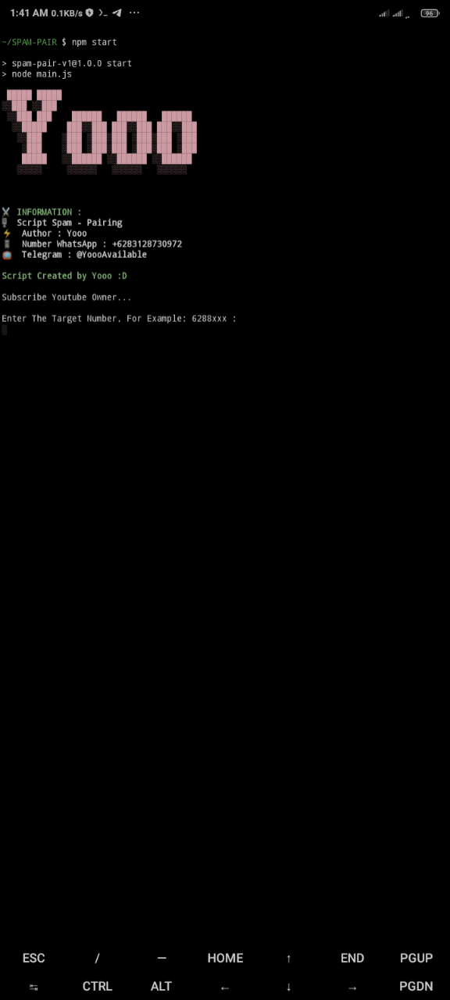

SPAM-PAIR



SPAM-PAIR is a simple Node.js-based tool used to send spam WhatsApp pairing codes to target devices. This tool is intended for educational and light prank purposes only. Please use it responsibly and ethically.

⚠️ Disclaimer
This tool is for educational and experimental purposes only.
Misusing it for illegal activities or invading someone's privacy is strictly prohibited and may violate laws. The developer is not responsible for any misuse of this tool.

🛠️ Features
Automatically sends spam WhatsApp pairing codes.

Works on multiple platforms: Termux (Android), Linux, and Windows.

Easy setup using Node.js and Git.

📦 System Requirements
Node.js version 20 or newer.

Git to clone the repository.

An active internet connection.

✅ Check Node.js & NPM
Before installing, make sure you have Node.js and NPM installed:

```bash
node -v
npm -v
```
If these commands return version numbers (e.g. v20.x.x and 9.x.x), you're good to go.

If not, please install Node.js and NPM first:

Node.js official site

🚀 Installation
Termux (Android)
```bash
apt update && apt upgrade -y
apt install nodejs git -y
git clone https://github.com/YoooBoyzz/SPAM-PAIR
cd SPAM-PAIR
npm install
Linux (Debian/Ubuntu)
bash
Copy code
sudo apt update && sudo apt upgrade -y
sudo apt install nodejs git -y
git clone https://github.com/YoooBoyzz/SPAM-PAIR
cd SPAM-PAIR
npm install
```


Windows (Git Bash)
Make sure you have Node.js and Git installed.

Open Git Bash and run:

```bash
git clone https://github.com/YoooBoyzz/SPAM-PAIR
cd SPAM-PAIR
npm install
```


▶️ Usage
Navigate to the project directory:

bash
Copy code
cd SPAM-PAIR

Run the script :
```bash
npm start
```
Follow the instructions in the terminal to input the target WhatsApp number.


Note: If there's a file named auth, delete it first before running the script:

```bash
rm -r auth
```

